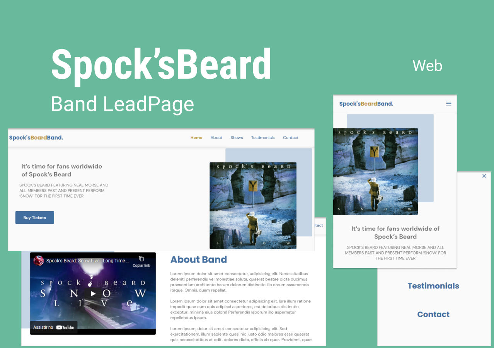

  <a href="#-tecnologias">Technologies</a>&nbsp;&nbsp;&nbsp;|&nbsp;&nbsp;&nbsp;
  <a href="#-projeto">Project</a>&nbsp;&nbsp;&nbsp;|&nbsp;&nbsp;&nbsp;
  <a href="#-layout">Layout</a>&nbsp;&nbsp;&nbsp;|&nbsp;&nbsp;&nbsp;
  

 

  

## 🚀 Technologies

This project was developed with the technologies:

- HTML
- CSS
- JavaScript

Libraries

- [Google Fonts](https://fonts.google.com/)
- [SwipeJS](https://github.com/nolimits4web/Swiper)
- [ScrollRevel](https://scrollrevealjs.org)

Utilities

- [randomuser.me](https://randomuser.me/photos)
- [IconMoon](https://icomoon.io/app/#/select)

## 💻 Project

SpocksBeard Leadpage band is a responsive One Page format page for use on a variety of devices. Sections used in the project: Header, Navigation, Home, About, Services, Testimonials, Contact and Footer. 

## 🔖 Layout

You can view the project layout through: [desse link](https://www.figma.com/file/3JjqzFJ5PCNZx3vDEAcgdW/Origin-Six-(Community)?node-id=120%3A3). It is necessary to have an account in the [Figma](https://figma.com) to access it.

## 📝 Link

The project can be viewed at this link: [SpocksBeardPage](https://mateus2314.github.io/leadpage_SpockBeardBand/)

---

Coding by Mateus De La Fuente Cezar in Rocketseat exercise
